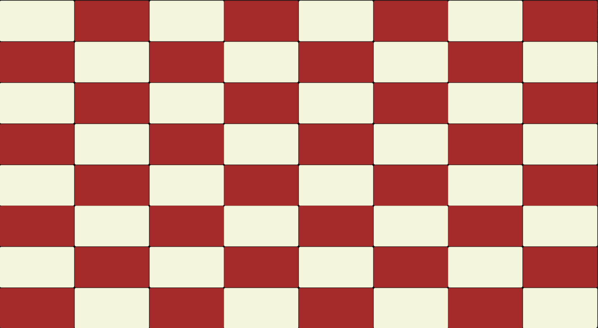

# Jeu d'Échecs en C#

Un jeu d'échecs développé en C#. Le projet est actuellement en cours de développement : l'affichage console est fonctionnel et la transition vers une interface graphique (IHM) est la prochaine étape majeure.

> **Projet en cours de développement** — Les bases du projet sont posées, mais la logique des règles et l'interface graphique sont en cours d'implémentation.

---

## État du projet & Feuille de route

### Moteur de jeu (`Metier`)
- [x] Implémentation du plateau et des pièces d'échecs
- [ ] Règles de déplacement (Pion, Tour, Cavalier, Fou, Reine, Roi)
- [ ] Vérification et validation des coups légaux
- [ ] Gestion des coups spéciaux (Roque, Promotion)
- [ ] Détection de l'échec, échec et mat, et pat

### Interface Graphique (`IHM` - Avalonia UI)
- [x] Création de la grille dynamique 
- [x] Migration vers l'architecture MVVM
- [ ] Affichage des visuels des pièces (`Assets`)
- [ ] Système de *Drag & Drop* pour déplacer les pièces
- [ ] Indicateur visuel des cases jouables

### Fonctionnalités à venir
- [ ] Compteur de temps (Timer)
- [ ] Historique des coups joués (Notation PGN)
- [ ] Multijoueur Local
- [ ] Mode de jeu contre une IA

---

## Technologies utilisées

- **Langage** : C# (.NET)
- **Framework Graphique** : Avalonia UI (Compatible Windows, Linux, macOS)
- **IDE** : Visual Studio Code

---

## Architecture du projet

Le projet est structuré selon le patron de conception MVVM (Modèle-Vue-ViewModel) afin d'assurer une séparation stricte entre la logique métier du jeu d'échecs et l'interface graphique :

-Modèle (Model) : Contient la logique métier pure du jeu d'échecs (état du plateau, règles de déplacement des pièces, validation des coups et détection du pat/échec). Il est totalement indépendant de l'interface graphique.

-Vue (View) : Définie en XAML via Avalonia UI, elle gère uniquement l'aspect visuel de l'échiquier et les éléments graphiques. Elle ne contient aucune logique de jeu.

-ViewModel : Fait le pont entre le Modèle et la Vue. Il transforme les données de l'échiquier pour les rendre affichables par la Vue et expose les commandes (clics sur les cases, sélection d'une pièce) grâce au Data Binding.

---

## Aperçu actuel

Interface graphique développée sous **Avalonia UI** avec rendu dynamique du plateau d'échecs (cases couleur crème et bordeaux) :



## Installation et exécution

### Prérequis
- SDK .NET (version 10.0 ou supérieure )
- Avalonia UI *(v11+)*

### Lancement
1. **Cloner le projet**
   ```bash
   git clone git@github.com:jenny-rcd/echecs.git
   cd echecs/IHM
   ```
2. **lancer le projet**
   ```bash
   dotnet run
   ```
   
---
## Auteur

- **jenny-rcd** — Développeur principal — [*Profil GitHub*](https://github.com/jenny-rcd)

